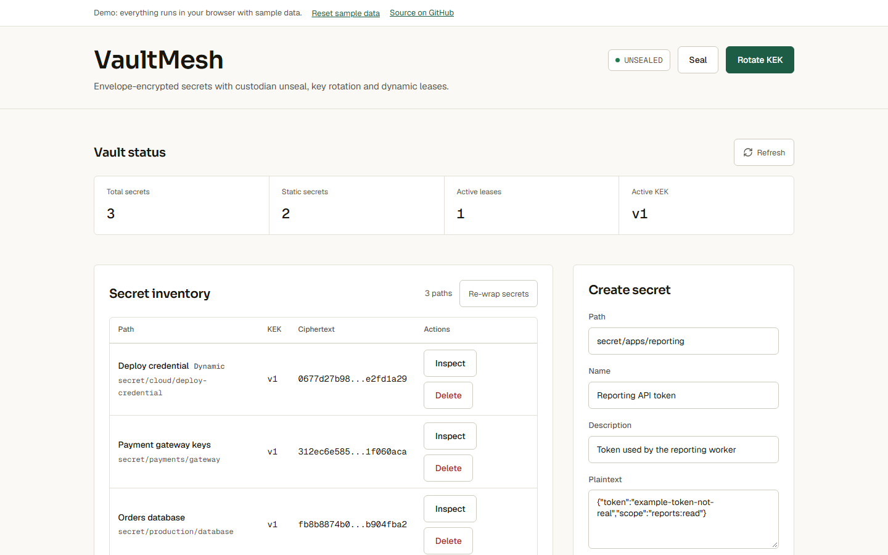
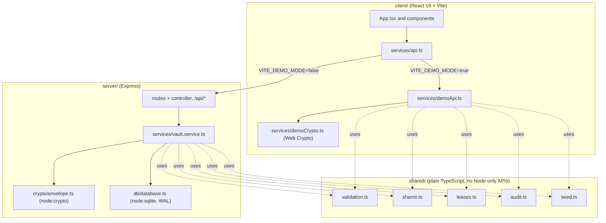

# VaultMesh

VaultMesh is a local secrets manager for trying out the mechanics behind a production KMS end to end: envelope encryption, Shamir threshold unseal, key rotation, dynamic leased credentials and a tamper-evident audit log. It ships as an Express API with a React dashboard, for developers who want to see how these pieces fit together without standing up a real KMS.

[](https://github.com/Taan1el/vaultmesh/actions/workflows/ci.yml)
[](https://github.com/Taan1el/vaultmesh/actions/workflows/pages.yml)
[](LICENSE)

**Live demo:** https://taan1el.github.io/vaultmesh/

The demo runs entirely in your browser: the same validation, Shamir, lease, audit and seed logic the server uses runs against the Web Crypto API and localStorage instead of a real API, so it works with no backend.

## Screenshot



More screenshots: [inspecting a decrypted secret](docs/screenshots/02-inspect-secret.png), [custodian unseal and dynamic leases](docs/screenshots/03-unseal-and-leases.png), [mobile layout](docs/screenshots/04-mobile.png).

## Features

- **Custodian unseal**: 3-of-5 Shamir secret sharing rebuilds the root key from any three of five shares. A forged, duplicate or malformed share is rejected, and a failed attempt clears progress instead of leaving the vault stuck.
- **Envelope encryption**: every secret gets a single-use AES-256-GCM data-encryption key (DEK), which is itself wrapped by the active key-encryption key (KEK).
- **Key rotation and re-wrap**: rotate to a new KEK, then re-wrap existing secrets' DEKs onto it without ever decrypting the stored payload.
- **Dynamic leases**: a dynamic secret issues a time-limited lease on read, renewable up to 5 times and capped by a max TTL. Expired leases are swept automatically, and reading again issues a fresh lease.
- **Tamper-evident audit ledger**: every action is chained with a SHA-256 hash over the entry before it, and a verification endpoint reports exactly where a chain breaks.
- **React 19 dashboard**: a stats strip for the vault totals, a secret inventory table with a decrypt-and-inspect drawer, custodian unseal with a share checklist, key version history, lease countdowns, and the audit ledger, polling every 5 seconds.
- **GitHub Pages demo mode**: no backend required; data is seeded and kept in your browser's localStorage, with a "Reset demo data" control.

## Getting started

### Prerequisites
- Node.js 22.5 or newer (built and tested on Node.js 24.14.1; `node:sqlite` needs 22.5+)
- npm 10 or newer (tested on npm 11.11.0)

### Install
```bash
git clone https://github.com/Taan1el/vaultmesh.git
cd vaultmesh
npm install
```

### Run
```bash
npm run dev
```
This starts the Express API on port 4005 and the Vite dashboard on port 3005 together, and stops both when either exits. Open **http://localhost:3005**.

### Environment variables
None of these are required to run the defaults shown above.

| Variable | Used by | Default | Purpose |
|---|---|---|---|
| `PORT` | server | `4005` | Port the Express API listens on. See `server/.env.example`. |
| `HOST` | server | `127.0.0.1` | Interface the API binds to. The API has no authentication, so this defaults to loopback only. |
| `VAULTMESH_DB_PATH` | server | `server/data/vaultmesh.db` | Where the SQLite database file is stored. |
| `VITE_API_TARGET` | client (dev only) | `http://127.0.0.1:4005` | Where the Vite dev server proxies `/api` requests, for when the server runs on a different port. See `client/.env.example`. |

## Scripts

Run from the repo root unless noted otherwise.

| Script | What it does |
|---|---|
| `npm run dev` | Runs the server (`tsx watch`) and client (Vite) together |
| `npm run build` | Builds the server, then the client, for production |
| `npm run build:pages` | Builds the client in demo mode (`client/dist-pages`), for GitHub Pages |
| `npm test` | Runs the server test suite, then the client test suite |
| `npm run test:e2e` | Runs the Playwright browser workflow against the real API and dashboard |
| `npm run screenshots:e2e` | Runs the Playwright workflow and refreshes the e2e dashboard screenshot |
| `npm run lint` | Typechecks the server, then the client (`tsc --noEmit`) |

## How it works

`shared/` holds the vault logic used by both the server and the browser demo: `validation.ts` (input rules), `shamir.ts` (secret splitting and reconstruction), `leases.ts` (renewal and revocation rules), `audit.ts` (the hash-chain format) and `seed.ts` (the sample secrets). Only storage and native crypto differ: the server persists to SQLite and encrypts with `node:crypto` (`server/src/crypto/envelope.ts`, `server/src/db/database.ts`), while the browser demo persists to `localStorage` and encrypts with the Web Crypto API (`client/src/services/demoApi.ts`, `demoCrypto.ts`), producing the same wrapped-key format (`iv:authTag:ciphertext` in hex) either way.



### Project layout

```
vaultmesh/
  client/                    React 19 + Vite dashboard
    src/components/          AuditLedger, CreateSecretForm, DemoBanner, LeaseList, SecretDrawer, UnsealPanel
    src/services/            api.ts (real API, and the demo/real switch), demoApi.ts (in-browser vault), demoCrypto.ts (Web Crypto envelope encryption)
  server/                    Express API
    src/app.ts               Express app: JSON body parsing, API mount, static client build, JSON error handling
    src/services/            vault.service.ts: seal/unseal, KEK rotation, secrets, leases, audit
    src/crypto/              envelope.ts (AES-256-GCM), shamir.ts (Buffer wrapper over shared/shamir.ts)
    src/db/database.ts       SQLite schema and connection (node:sqlite, WAL mode)
    src/routes/, src/controllers/  Route table and request handling
  shared/                    Validation, Shamir secret sharing, lease rules, audit hash chain and seed data used by both the server and the browser demo
  docs/screenshots/          README screenshots
```

## API reference

All routes are mounted under `/api` except `/health`. Responses are the JSON shapes below directly (no wrapper); errors are always `{ "error": "..." }`. Checked against `server/src/routes/api.routes.ts` and `server/src/controllers/vault.controller.ts`.

| Method | Path | Body / query | Response data | Errors |
|---|---|---|---|---|
| GET | `/health` | - | `{ status, service }` | - |
| GET | `/api/vault/status` | - | `VaultState` | - |
| GET | `/api/vault/demo-shares` | - | `{ shares: string[] }` | - |
| POST | `/api/vault/seal` | - | `{ message, state: VaultState }` | - |
| POST | `/api/vault/unseal` | `{ share }` | `UnsealProgress` | 400 missing/invalid share, 409 share already submitted |
| POST | `/api/vault/unseal/reset` | - | `{ message }` | - |
| GET | `/api/vault/keks` | - | `KekVersionInfo[]` | - |
| POST | `/api/vault/keks/rotate` | - | `KekVersionInfo` | 503 sealed |
| POST | `/api/vault/keks/rewrap` | - | `{ rewrappedCount, activeVersion }` | 503 sealed |
| GET | `/api/secrets` | - | `StoredSecret[]` | - |
| POST | `/api/secrets` | `CreateSecretDto` | `StoredSecret` (201) | 400 invalid field, 409 path exists, 503 sealed |
| GET | `/api/secrets/:path` | - | `DecryptedSecret` | 404 not found, 503 sealed |
| DELETE | `/api/secrets/:path` | - | `{ message, path }` | 404 not found, 503 sealed |
| GET | `/api/leases` | - | `SecretLease[]` | - |
| POST | `/api/leases/:id/renew` | `{ incrementSeconds? }` | `SecretLease` | 400 invalid increment, 404 not found, 409 cannot renew, 503 sealed |
| POST | `/api/leases/:id/revoke` | - | `SecretLease` | 404 not found, 409 cannot revoke, 503 sealed |
| GET | `/api/audit` | query `limit?` | `AuditEntry[]` | 400 invalid limit |
| GET | `/api/audit/verify` | - | `AuditVerificationResult` | - |

Shapes (`VaultState`, `StoredSecret`, `DecryptedSecret`, `SecretLease`, `KekVersionInfo`, `AuditEntry`, `AuditVerificationResult`) are defined in `shared/types.ts`.

## Testing

- **Vault core** (`server/test`): Shamir share validation and threshold reconstruction, envelope encryption round-trips, secret and lease and audit input validation, the audit hash chain and tamper detection, lease issue/renew/revoke/expiry limits, seal state across a restart, and the no-CORS/JSON-only/loopback hardening.
- **API** (`server/test/api-errors.test.ts`, `api-validation.test.ts`): the JSON error shape, unknown routes returning a 404, malformed and oversized request bodies, and that error responses never leak internal detail.
- **Client** (`client/src/App.test.tsx`, React Testing Library): the unseal flow, secret inventory and inspect drawer, lease countdowns and actions, the audit ledger, and singular/plural count labels.
- **Demo adapter** (`client/src/services/demoApi.test.ts`, `demoCrypto.test.ts`, `api.test.ts`): the in-browser vault against the same `VaultApi` interface as the real API, Web Crypto envelope encryption round-trips, and the real-vs-demo switch.
- **Browser workflow** (`tests/e2e/vault-workflow.spec.ts`, Playwright): the real dashboard plus API path for inspect, create dynamic secret, seal, failed read while sealed, three-share unseal, read after unseal, KEK rotate and re-wrap.

Run the unit and component suites with `npm test` (or `npm run test:server` / `npm run test:client` separately). Run the browser workflow with `npm run test:e2e`.

## Deployment

### Docker
```bash
docker compose up --build
```
Serves the built dashboard and API together at **http://localhost:4005**. Compose only publishes the port on `127.0.0.1` since the API has no authentication. The image runs as the unprivileged `node` user and stores the SQLite file in a named volume.

### GitHub Pages
`.github/workflows/pages.yml` runs `npm run build:pages` and publishes `client/dist-pages` on every push to `main`. The deploy step is skipped while the repository is private and starts working once it is made public.

## Design notes and limitations

- There is no authentication on the API. Anyone who can reach it can read secrets, seal the vault, or rotate keys. It binds to `127.0.0.1` by default; do not expose it to the public internet as-is.
- Custodian shares are exposed through a demo endpoint and the dashboard's "Load next sample share" button so the unseal flow is easy to try locally. A production system would distribute shares out of band and never expose them through an API.
- Dynamic lease "credentials" are simulated placeholder values. Lease issuance, renewal limits and expiry are real; nothing mints actual cloud provider credentials.
- Storage is a single SQLite file (WAL mode): it is not shared across multiple server instances, and the schema is created with `CREATE TABLE IF NOT EXISTS` rather than migrations.
- The GitHub Pages demo keeps its vault in the browser's localStorage: it is per-browser, not shared between visitors, and can be cleared at any time (private windows, storage limits, or the browser itself).
- This has not had a security review. Treat it as a demonstration of envelope encryption, threshold unseal and audit-chain techniques, not as a production key management system.

## Roadmap

- Role-based access controls around secret reads and key operations.
- Migration tooling for database schema changes.
- A real cloud provider integration behind the dynamic-lease interface, instead of simulated values.
- Policy simulation for secret read approvals and denied access paths.

## License

MIT, see [LICENSE](LICENSE).
